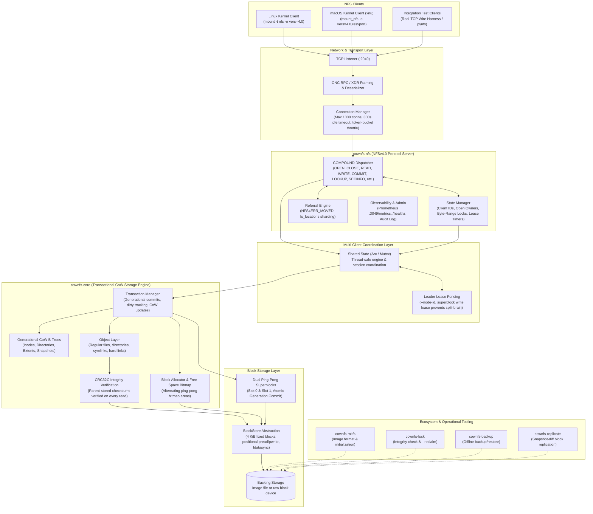

# cownfs

A from-scratch userspace copy-on-write filesystem in the spirit of ZFS and Btrfs,
written in Rust, exported directly over NFSv4.0. One self-contained server binary,
mountable from any operating system with a standard NFS client — no kernel modules,
no FUSE, and no NFS-Ganesha.

---

## Architecture

`cownfs` couples a transactional storage engine directly to an NFSv4.0 server
within a single process. It operates directly on a raw block device or image file,
enforcing crash consistency through pure copy-on-write and atomic dual-superblock commits.



### Architectural Highlights

1. **Pure Copy-on-Write Storage Engine (`cownfs-core`)**:
   - **No in-place overwrites**: Every write allocates new 4 KiB blocks. Trees are copied bottom-up along the path to the root.
   - **No write-ahead log / journal**: Crash consistency is guaranteed by alternating dual superblocks (slots 0 and 1). A transaction becomes durable only when the next generation superblock is successfully synced.
   - **Parent-stored checksums**: Data extents store CRC32C checksums in their parent B-tree pointers, detecting bit-rot and phantom writes on every read.
   - **Instant snapshots**: Creating a snapshot copies only the current tree roots; data blocks diverge on subsequent modifications with reference-counted sharing.

2. **Native NFSv4.0 Protocol Implementation (`cownfs-nfs`)**:
   - **Self-contained RPC/XDR**: Pure Rust implementation of ONC RPC framing, XDR serialization, and the NFSv4.0 COMPOUND procedure model.
   - **Stateful Locking & Leases**: Manages client IDs, open owners, byte-range locks, sequence IDs, and lease timeouts without external coordination.
   - **Multi-Client Concurrency**: `Shared` handles concurrent client connections over a multi-threaded listener with per-connection sessions.

3. **Production Hardening & High Availability**:
   - **Split-brain fencing**: An on-disk leader lease in the superblock allows active primaries to fence out stale primaries during failovers.
   - **Transparent Sharding**: Implements standard NFSv4.0 referrals (`fs_locations` and `NFS4ERR_MOVED`) for horizontal scaling without cluster protocols.
   - **Observability**: Built-in Prometheus metrics, `/healthz` endpoints, structured JSON logging, and connection rate throttling.

---

## Status

**Current Tier: Minimal Production Readiness** (2026-10).

The project has completed its core development milestones (P0–P7) and production hardening phases (P8–P28). All **178 integration and unit tests pass** across the workspace.

See [docs/production-readiness.md](docs/production-readiness.md) for the detailed production checklist and operational runbooks.

### Implementation Breakdown

| Component | Status | Details |
|---|---|---|
| **Block Device & Superblock (P0)** | Complete | 4 KiB block device, CRC32C checksums, ping-pong dual superblocks, free-space bitmap |
| **Generational CoW B-Tree (P1)** | Complete | In-memory generational B-tree, model-tested against `BTreeMap` over 135k random ops |
| **Filesystem Engine (P2)** | Complete | Inodes, directories, symlinks, hard links, refcounted blocks, parent-stored data checksums |
| **Snapshots (P3)** | Complete | O(1) snapshot creation, shared-root references, CoW block divergence, snapshot-pinned blocks |
| **NFSv4.0 Read Server (P4)** | Complete | Hand-rolled RPC/XDR stack, COMPOUND decoder, read-only dispatch, wire verification |
| **NFSv4.0 Mutation Path (P5)** | Complete | `OPEN`, `CREATE`, `WRITE`, `COMMIT`, `REMOVE`, `RENAME`, `SETATTR` |
| **NFSv4.0 State Engine (P6)** | Complete | Client ID lifecycle, open owners, byte-range locks (`LOCK`/`LOCKU`), seqid validation, leases |
| **Integrity & Offline Repair (P7)** | Complete | Fault injection, mark-and-sweep block reclaimer (`cownfs-fsck --reclaim`), soak testing |
| **Wire-Level TCP Suite (P8–P11)** | Complete | 40 real-TCP harness tests: error paths, attr coverage, I/O semantics, state machine |
| **Concurrency & Shared State (P12)** | Complete | Thread-safe `Shared` engine and state manager across concurrent client TCP streams |
| **Client Interoperability (P13)** | Complete | macOS xnu & Linux compatibility: `SECINFO`, empty attr masks, `GUARDED4`/`EXCLUSIVE4`, `ILLEGAL` op |
| **Kernel Workload Soak (P14–P15)** | Complete | Linux kernel tarball unpack + recursive verification, heavy concurrency stress testing |
| **Replication & HA (P16–P18, P23)** | Complete | Read-only replica mode, snapshot-diff replication (`cownfs-replicate`), superblock-last crash safety |
| **Scale-Out via Referrals (P22, P24)** | Complete | Transparent sharding with `fs_locations` and `NFS4ERR_MOVED` (`--referrals` config) |
| **Data Block Checksums (P25)** | Complete | Parent-stored CRC32C checksums for all data extents, verified on every read |
| **Backup & Restore (P26)** | Complete | `cownfs-backup` offline streaming backup and restore with full checksum validation |
| **Leader Lease Fencing (P27)** | Complete | Superblock write leases (`--node-id`, `--lease-ttl`) to prevent dual-primary split-brain |
| **Traffic Throttling (P28)** | Complete | Token-bucket rate limiting per client IP and per file |
| **Experimental pNFS / v4.1 (P19–P21)** | Prototype | `cownfs-ds` data server, NFSv4.1 sessions (`EXCHANGE_ID`, `CREATE_SESSION`), file layouts |

### Real-World Client Validation

The server is actively tested against native operating system clients:

- **macOS Kernel Client (`xnu`)**:
  - Full RFC 7530 OPEN wire format compliance (`seqid`, `share_access`, `share_deny`).
  - Comprehensive `GETATTR` attribute support for all REQUIRED attributes (`CHANGE`, `SUPPORTED_ATTRS`, `FH_EXPIRE_TYPE`, `LEASE_TIME`, etc.).
  - Proper handling of empty `GETATTR` attribute masks (preventing `ESTALE` during file probes).
  - Explicit write-bit grants in `ACCESS` replies (necessary for macOS to issue `CREATE`).
  - Supported `OP_SECINFO` (33) operations bundled into lookup, create, and remove compounds.
  - Correct socket blocking mode preservation on connection accept.
- **Linux Kernel Client**:
  - Validated against standard POSIX workflows, multi-gigabyte file transfers, and compilation tarball extractions.

### Known Gaps & Limitations

- **Authentication**: `AUTH_SYS` only (suitable for trusted networks, isolated VPCs, and container networks). Kerberos / `RPCSEC_GSS` is deferred.
- **Advanced POSIX/NFS Features**: No quotas, POSIX ACLs, extended attributes (xattrs), or server-side delegations.
- **Clustering Strategy**: pNFS is experimental; NFSv4.0 referrals are the recommended production path for horizontal scaling. See [docs/v40-scaleout.md](docs/v40-scaleout.md).

---

## Quick Start

### 1. Build and Initialize

Prerequisites: A modern Rust toolchain (install via [rustup.rs](https://rustup.rs)).

```sh
git clone https://github.com/heikofkoehler/cownfs.git
cd cownfs
cargo build --release

# Format a 1 GiB filesystem image
./target/release/cownfs-mkfs --size 1G /tmp/cow.img

# Start the server (binds to 127.0.0.1:2049 by default)
./target/release/cownfs-server /tmp/cow.img 127.0.0.1:2049 &
```

### 2. Mount

#### Linux
```sh
sudo mkdir -p /mnt/cow
sudo mount -t nfs -o vers=4.0,port=2049 127.0.0.1:/ /mnt/cow

# Unmount when finished
sudo umount /mnt/cow
```

#### macOS
```sh
sudo mkdir -p /Volumes/cow
sudo mount -t nfs -o vers=4.0,tcp,port=2049,resvport 127.0.0.1:/ /Volumes/cow

# Unmount when finished
sudo umount /Volumes/cow
```

*(Note: On older macOS versions that reject `vers=4.0`, use `vers=4`.)*

### 3. Verification & Maintenance

```sh
# Verify image consistency
./target/release/cownfs-fsck /tmp/cow.img

# Verify and reclaim leaked unreferenced blocks
./target/release/cownfs-fsck --reclaim /tmp/cow.img

# Replicate to a secondary image via snapshot diffs
./target/release/cownfs-replicate /tmp/cow.img /tmp/replica.img

# Run test suite
cargo test --workspace
```

---

## Production Deployment

```sh
# Start primary server with leader lease fencing
./target/release/cownfs-server \
    --node-id primary1 \
    --lease-ttl 30 \
    /data/cow.img 0.0.0.0:2049 &

# Start read-only replica
./target/release/cownfs-server \
    --read-only \
    /data/replica.img 0.0.0.0:2050 &

# Start referral server for transparent horizontal sharding
./target/release/cownfs-server \
    --referrals /etc/cownfs/referrals.conf \
    /data/namespace.img 0.0.0.0:2049 &

# Scrape Prometheus metrics and check health (port + 1000)
curl http://localhost:3049/metrics
curl http://localhost:3049/healthz

# Perform offline full backup
./target/release/cownfs-backup create /data/cow.img /backups/cow-$(date +%F).bak

# Enable NetApp-style telescoping snapshots: 24 hourly, 7 daily, 4 weekly.
# The server creates timestamped snapshots (hourly-YYYYMMDD-HHMMSS) on a
# 60s tick and prunes each tier beyond its keep count. Browse them at
# .snapshots/ over NFS; manage manually with cownfs-snapshot.
./target/release/cownfs-server \
    --snapshot-policy hourly:24,daily:7,weekly:4 \
    /data/cow.img 0.0.0.0:2049 &
```

See [docs/production-readiness.md](docs/production-readiness.md) for complete operational guides, monitoring alerts, and failover runbooks.

---

## Repository Layout

- [`crates/cownfs-core/`](crates/cownfs-core/) — Block device abstraction, superblock management, free-space bitmap, CRC32C parent checksums, generational CoW B-tree, and filesystem engine.
- [`crates/cownfs-nfs/`](crates/cownfs-nfs/) — Hand-written RPC/XDR serialization, NFSv4.0 COMPOUND dispatcher, stateful locking manager, referral engine, and server binaries:
  - `cownfs-server` — Main NFSv4.0 server daemon
  - `cownfs-backup` — Offline streaming backup/restore utility
  - `cownfs-replicate` — Incremental snapshot-diff replication tool
  - `cownfs-snapshot` — Offline snapshot create/list/info/delete CLI
  - `cownfs-shard` & `cownfs-cluster` — Sharding orchestration utilities
  - `cownfs-ds` — Experimental pNFS data server
- [`crates/cownfs-mkfs/`](crates/cownfs-mkfs/) — Filesystem formatter (`cownfs-mkfs`).
- [`crates/cownfs-fsck/`](crates/cownfs-fsck/) — Offline consistency checker and block reclaimer (`cownfs-fsck`).
- [`crates/cownfs-bench/`](crates/cownfs-bench/) — Micro-benchmarking harness for core engine and end-to-end NFS RPCs.
- [`docs/`](docs/) — In-depth architectural and operational specifications:
  - [architecture-plan.md](docs/architecture-plan.md) — Comprehensive technical design and on-disk format.
  - [garbage-collection.md](docs/garbage-collection.md) — Three-tier space reclamation, snapshot pinning, and offline mark-and-sweep GC.
  - [production-readiness.md](docs/production-readiness.md) — Production operations, reliability, and failover.
  - [v40-scaleout.md](docs/v40-scaleout.md) & [horizontal-scaling-plan.md](docs/horizontal-scaling-plan.md) — Referrals and sharding architecture.
  - [benchmark.md](docs/benchmark.md) & [p7-soak-results.md](docs/p7-soak-results.md) — Performance metrics and soak test results.

---

## Performance Snapshot

*Measured on release build, virtual disk (see [docs/benchmark.md](docs/benchmark.md) for full methodology):*

- **Sequential write throughput**: ~80 MiB/s.
- **File creations**: ~24,000 files/sec.
- **Snapshot create & delete**: ~7 µs.
- **Atomic commit latency**: ~24 ms (flush + bitmap + fsync + superblock flip). 4 KiB `FILE_SYNC` writes run at ~40 IOPS without write caching. Reads are served from page cache.

---

## Core Principles

1. **Never overwrite live data in place**: Crash consistency is achieved via pure copy-on-write and atomic superblock generation flips. No journal or replay log is needed.
2. **End-to-end data integrity**: Checksums on all data and metadata (stored in parent pointers and verified on read) prevent undetected bit-rot.
3. **Cheap snapshots**: Creating a snapshot is a pointer copy of tree roots; subsequent writes diverge naturally on modification.
4. **Transport independence**: The core storage engine is decoupled from the NFS server and is tested independently of networking.
5. **Memory safety**: Written in safe Rust without `unsafe` code in core engine paths.
6. **Real-world client interoperability**: Strict protocol conformance where possible, prioritizing real-world client compatibility (macOS xnu, Linux kernel) and documenting necessary deviations.
