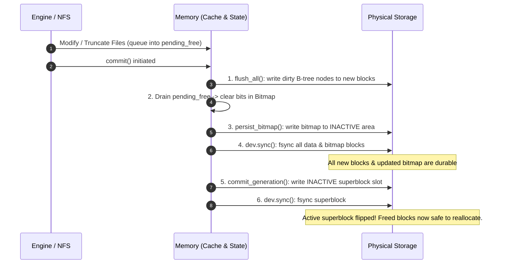
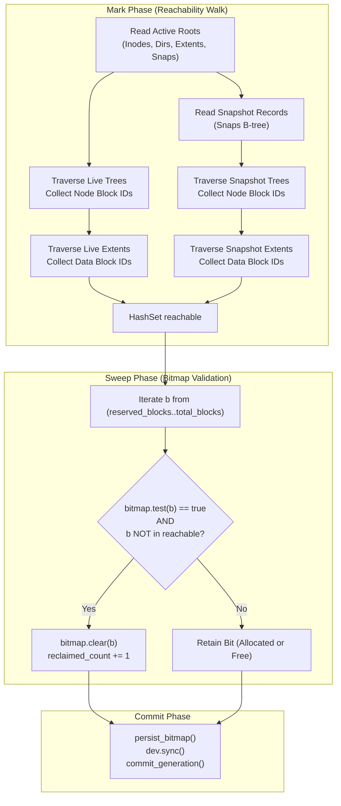

# Garbage Collection and Space Reclamation in cownfs

**Status:** Design and Implementation Complete (P0–P7, P25)  
**Modules:** `crates/cownfs-core/src/engine.rs`, `crates/cownfs-core/src/store.rs`, `crates/cownfs-core/src/bitmap.rs`

---

## 1. Overview

In an in-place filesystem (e.g., ext4, XFS), modifying an existing file overwrites blocks at fixed logical addresses. In a pure copy-on-write (CoW) filesystem like `cownfs`, live blocks are never overwritten. Every metadata update or file write allocates newly assigned 4 KiB physical blocks.

As new versions of tree nodes and file extents are written, old blocks become obsolete. Space reclamation in `cownfs` addresses three distinct challenges:

1. **Transactional Safety:** An obsolete block cannot be reallocated within the same uncommitted transaction, because a mid-transaction crash would corrupt the previously committed generation.
2. **Snapshot Retention:** Blocks shared between the live filesystem and historical snapshots must remain preserved until the last referencing snapshot is deleted.
3. **Leak Recovery:** Blocks allocated by transactions that crashed prior to committing their superblock must be identified and returned to the allocator.

To solve these challenges, `cownfs` uses a **three-tier space reclamation system**:

```
+-------------------------------------------------------------------------+
| Tier 1: Online Transactional Deferred Frees                             |
| (Queue blocks in pending_free; clear bitmap bits during atomic commit)  |
+-------------------------------------------------------------------------+
                                    |
                                    v
+-------------------------------------------------------------------------+
| Tier 2: Snapshot Pinning and B-Tree Refcounting                         |
| (Retain blocks in snapshot_pinned / Node::refcount; reclaim on delete)  |
+-------------------------------------------------------------------------+
                                    |
                                    v
+-------------------------------------------------------------------------+
| Tier 3: Mark-and-Sweep Offline GC                                       |
| (cownfs-fsck --reclaim: walk all live & snapshot trees, sweep bitmap)   |
+-------------------------------------------------------------------------+
```

---

## 2. Tier 1: Online Transactional Deferred Frees

### 2.1 The Crash-Consistency Hazard

If an overwritten or truncated block were immediately marked free in the active bitmap, the allocator could hand out that exact block for a subsequent write within the *same* uncommitted transaction. 

If power fails or the process crashes before that transaction commits, the active on-disk superblock would still point to the *previous* generation. But that generation's data blocks would now contain uncommitted garbage, causing catastrophic data corruption.

```
HAZARD (If freed immediately):
1. Tx N (committed): Inode A -> Block 42
2. Tx N+1 (in progress): Overwrite Inode A -> Alloc Block 100.
3. [IMMEDIATE FREE]: Block 42 freed in bitmap.
4. Tx N+1: Write Inode B -> Alloc Block 42! (overwrites Block 42 with Inode B data)
5. CRASH before Tx N+1 commits.
6. Reboot to Tx N: Inode A reads Block 42 -> CORRUPTED DATA!
```

### 2.2 The Solution: `pending_free` Queue

`cownfs` resolves this by keeping freed blocks allocated until the transaction is durable:

1. When an extent or metadata node is freed, it is appended to `Shared::pending_free`:
   ```rust
   // crates/cownfs-core/src/engine.rs
   fn free_block(&mut self, blk: u64) {
       if self.snapshot_pinned.contains(&blk) {
           // Guarded by snapshot (Tier 2)
       } else {
           self.shared.lock().unwrap().pending_free.push(blk);
       }
   }
   ```
2. The block's bit in the allocator's in-memory `Bitmap` **remains 1 (allocated)**. The allocator will not hand it out.
3. During `commit()`, blocks are drained and freed only when switching to the new generation.

### 2.3 The Commit Pipeline



### 2.4 Ping-Pong Bitmap Areas

To avoid corrupting the bitmap across crashes, `cownfs` allocates **two alternating bitmap areas** on disk (`area 0` and `area 1`). 

* The current active superblock points to the currently active bitmap area.
* During commit, the new bitmap is written to the *inactive* area.
* Once synced, the superblock flips `sb.bitmap_area = 1 - sb.bitmap_area` along with the generation increment.
* If a crash occurs before the superblock write, the prior superblock still points to the prior intact bitmap area.

---

## 3. Tier 2: Snapshot Pinning and Reference Counting

Snapshots in `cownfs` share all existing tree nodes and data blocks without copying. Space reclamation must never free a block that remains reachable by any active snapshot.

### 3.1 Metadata Nodes: Tree Refcounting

Each B-tree node (`Node<K, V>`) includes an on-disk `refcount`:

```rust
pub struct Node<K, V> {
    pub keys: Vec<K>,
    pub values: Vec<V>,
    pub children: Vec<NodeId>,
    pub refcount: u32,
}
```

* **Snapshot Creation (`share`)**: Increments the root node's `refcount` for each tree (inodes, dirs, extents):
  ```rust
  self.inodes.share(root_id)?;
  ```
* **CoW Mutation**: When a shared node (`refcount > 1`) is modified, CoW splits it: a new node with `refcount = 1` is allocated, and the old shared node's reference count is decremented.
* **Snapshot Deletion (`release`)**: Iteratively decrements reference counts in post-order:
  ```rust
  // crates/cownfs-core/src/store.rs
  fn dec_ref(&mut self, id: NodeId) -> Result<(), StoreError> {
      let mut stack = vec![id];
      while let Some(nid) = stack.pop() {
          let rc = {
              let e = self.load_mut(nid)?;
              e.node.refcount -= 1;
              e.node.refcount
          };
          if rc == 0 {
              let entry = self.cache.remove(&nid.idx).expect("just loaded");
              stack.extend(entry.node.children.iter().copied());
              self.free_block(nid.idx); // Enqueued to pending_free
          }
      }
      Ok(())
  }
  ```
  Only nodes with `refcount == 0` are pushed to `pending_free`. Nodes still shared with the live filesystem or other snapshots remain allocated.

### 3.2 File Data Blocks: `snapshot_pinned` Set

Because file data extents do not store per-block reverse reference counts on disk, `cownfs` maintains an in-memory pinning set:

1. **Building the Set**: At mount time (`Fs::open`), `rebuild_pinned()` scans all snapshot extent trees and populates `self.snapshot_pinned: HashSet<u64>` with every data block referenced by any snapshot.
2. **Write Protection**: When `free_block(blk)` is called during an overwrite or truncation:
   - If `blk ∈ snapshot_pinned`, the block is **not** pushed to `pending_free`. Its bitmap bit remains `1`.
   - If `blk ∉ snapshot_pinned`, it is queued to `pending_free`.
3. **Reclamation on Snapshot Delete**:
   When `snapshot_delete(snap_id)` is invoked:
   - The deleted snapshot's extent ranges are collected into `deleted_blocks`.
   - The snapshot record is removed from `snaps`.
   - `rebuild_pinned()` recomputes the pinned set for all *remaining* snapshots.
   - `reclaim_pinned()` checks which blocks in `deleted_blocks` are no longer in `snapshot_pinned` AND no longer in the live extent tree:
     ```rust
     // crates/cownfs-core/src/engine.rs
     for blk in deleted_blocks {
         if !self.snapshot_pinned.contains(&blk) && !live.contains(&blk) {
             self.shared.lock().unwrap().pending_free.push(blk);
         }
     }
     ```
   - These orphan blocks are enqueued to `pending_free` and reclaimed during the next transaction `commit()`.

---

## 4. Tier 3: Mark-and-Sweep Offline GC (`fsck --reclaim`)

### 4.1 The Uncommitted Allocation Leak

If an uncommitted transaction allocates new blocks from the bitmap and writes data, but the server experiences a sudden power loss before `commit()` completes:

* The superblock remains pointing to generation $N$.
* The bitmap in area $N$ does not contain the allocations made by transaction $N+1$.
* However, if the bitmap was partially written or if a crash interrupted block metadata syncing, blocks may remain marked as allocated in the bitmap even though no committed tree references them.
* These orphaned blocks are never reused by the normal allocator.

### 4.2 Mark-and-Sweep Algorithm

`cownfs-fsck --reclaim` (invoking `Fs::reclaim_unreachable()`) provides a complete mark-and-sweep garbage collection:



### 4.3 Code Implementation

```rust
// crates/cownfs-core/src/engine.rs
pub fn reclaim_unreachable(&mut self) -> Result<u64, FsError> {
    let mut reachable: HashSet<u64> = HashSet::new();

    // 1. Mark live metadata trees
    for ids in [
        self.inodes.verify()?,
        self.dirs.verify()?,
        self.extents.verify()?,
        self.snaps.verify()?,
    ] {
        reachable.extend(ids.iter().map(|id| id.idx));
    }

    // 2. Mark snapshot metadata trees and snapshot data blocks
    for (snap_id, _) in self.snapshot_list()? {
        let (inodes, dirs, extents) = self.snap_trees(snap_id)?;
        for ids in [inodes.verify()?, dirs.verify()?, extents.verify()?] {
            reachable.extend(ids.iter().map(|id| id.idx));
        }
        for (_, ext) in extents.to_sorted_vec()? {
            for b in ext.blk..ext.blk + ext.len as u64 {
                reachable.insert(b);
            }
        }
    }

    // 3. Mark live data extents
    for (_, ext) in self.extents.to_sorted_vec()? {
        for b in ext.blk..ext.blk + ext.len as u64 {
            reachable.insert(b);
        }
    }

    // 4. Sweep bitmap
    let reserved = 2 + 2 * self.sb.bitmap_blocks;
    let mut reclaimed = 0u64;
    {
        let mut sh = self.shared.lock().unwrap();
        for b in reserved..self.sb.block_count {
            if sh.bitmap.test(b) && !reachable.contains(&b) {
                sh.bitmap.clear(b);
                reclaimed += 1;
            }
        }
    }
    Ok(reclaimed)
}
```

---

## 5. Invariants and Safety Guarantees

| Invariant | Enforcement Mechanism |
|---|---|
| **No Overwrite of Committed Data** | All writes allocate fresh blocks. Old blocks remain unchanged on disk. |
| **No Premature Reallocation** | Freed blocks are held in `pending_free` until the new generation is synced and committed. |
| **Atomic Bitmap Updates** | Ping-pong alternating bitmap areas ensure the active generation always references its matching bitmap. |
| **Snapshot Independence** | Overwriting a file in the live filesystem preserves data blocks tracked in `snapshot_pinned`. |
| **Safe Snapshot Pruning** | Deleting a snapshot only frees blocks that have reference count 0 and are absent from all other snapshots and the live tree. |
| **Leak Self-Healing** | `cownfs-fsck --reclaim` rebuilds the active bitmap from ground truth (reachability of all live and snapshot trees). |

---

## 6. Operational Usage

### Checking and Reclaiming Blocks

Check filesystem health without modifying the image:
```sh
./target/release/cownfs-fsck /data/cow.img
```

Perform an offline mark-and-sweep garbage collection:
```sh
./target/release/cownfs-fsck --reclaim /data/cow.img
```
*Output:*
```
checked 65536 blocks: 4120 used, 61416 free, 0 errors
reclaimed 184 unreachable blocks
```

### Inspecting Free Space Online

Free block counts can be inspected via NFS `statvfs` or directly via Prometheus metrics:
```sh
curl http://localhost:3049/metrics | grep cownfs_space
```
* `cownfs_space_total_bytes` — Total capacity of the underlying image.
* `cownfs_space_free_bytes` — Available unallocated space in the active bitmap.
