# cownfs — Performance, Resiliency & Scale Plan v2

Basis: code at `2c5a9c3` (origin/main, 2026-10-04), plus `docs/performance-resiliency-scale-plan.md` (v1, 2026-10-03), `docs/test-gaps.md`, README status.
Scope: `cownfs-core` engine, `cownfs-nfs` server, tooling, and test infrastructure.

---

## 1. Executive summary

Since v1, most Phase-1 items have landed: txg batching, delta bitmap, alloc cursor, in-place overwrite of txg-local blocks, readahead, indexed LRU, bitmap CRCs, paged READDIR, incremental backup, crash fuzzer. **The deep review still found two classes of problem that should come before any further performance work:**

> [!CAUTION]
> **Data-loss risks (fix first)**
> 1. **R1 – The delta bitmap overwrites the only on-disk copy that the committed superblock still points at.** `persist_bitmap_delta` and `persist_bitmap_full` both write into area `1 - base`. That is where the *currently committed* generation's delta lives. If the process crashes between `commit_async` and the superblock flip, `apply_delta` sees a bad magic, gen, or CRC, **silently ignores the delta** and loads the stale base. Every block allocated since the last checkpoint then shows as free. The next allocations reuse them: silent corruption, which also matches the `stale NodeId` assert. The current crash fuzzer misses this: its 16K-block images cross the ">10% words dirty" threshold, so almost every commit is a full checkpoint.
> 2. **R2 – The NFS write verifier is a constant `[0;8]`** in WRITE and COMMIT. If the server restarts between an UNSTABLE WRITE and the client's COMMIT, the client sees the same verifier and never resends: acknowledged data is lost. Related: a `DATA_SYNC4` WRITE is answered as `DATA_SYNC4` without syncing anything.

> [!WARNING]
> **Biggest scale cliffs**
> - **Snapshots cost O(data), not O(changes).** `snapshot_pinned: HashSet<u64>` holds every data block of every snapshot (about 10 GB of RAM for 1 TiB). Snapshot create walks the whole live extent tree. Snapshot delete rebuilds the set over all snapshots × all extents. With the telescoping schedule this is the first thing that falls over.
> - **One extent record per 4 KiB block** (`len: 1` always). A 1 MiB read means 256 B-tree lookups. Extent metadata grows linearly with data.
> - **Mount time is O(all metadata + all snapshot data):** reachability walk, `rebuild_pinned`, `rebuild_quota_usage`, full xattr load.
> - **`free_block_count()` scans every bit on each GETATTR that asks for space attributes** (about 268M bit tests per call at 1 TiB, under the device mutex).

> [!IMPORTANT]
> **Biggest performance limiters**
> - The txg thread holds the **`Fs` write lock across both fsyncs**, so all readers stall for about one commit (~24 ms) on every dirty interval.
> - **NFS `COMMIT` bypasses group commit.** It calls a synchronous `commit()` under the write lock, and that is the main durability path for Linux clients.
> - `RwLock<Fs>` read concurrency is mostly nominal. Every node load goes through a per-tree `Mutex<BlockArena>` and a global `Mutex<Shared>` around the device, so parallel reads serialize.

---

## 2. Status of the v1 plan

| v1 item | Status | Notes |
|---|---|---|
| A1 bitmap write amplification | ✅ Done (delta + checkpoint) | **Introduced R1.** The delta is cumulative since the checkpoint and grows until a full rewrite every 100 commits |
| A2 allocation cursor | ✅ Done | Cursor only. No contiguity hint for sequential writes yet |
| A3 in-place overwrite | ⚠️ Partial | Only for blocks allocated *in the current txg*. Steady-state overwrites are still CoW |
| A4 vectored reads / readahead | ⚠️ Partial | `docs/readahead-strace.md`: warms the cache but does not cut syscalls. Blocked on contiguous extents (S2) |
| A5 node cache | ✅ Done | 10k nodes per arena, indexed LRU. Dirty nodes can't be evicted, so memory is unbounded within a large txg |
| A6 async I/O | ⏸ Deferred | `p51_conn_scale` exists. Still thread-per-connection |
| B1 txg error propagation | ✅ Done | `p41_txg_error` |
| B2 bitmap checksums | ✅ Done | CRC sidecar on the base area. The delta has its own CRC, but a mismatch is **ignored**, not failed over |
| B3/D3 fault injection | ⚠️ Partial | `FaultInjector` supports torn writes, bit flips and reordering, but there is no crash-state enumeration |
| B4 lease failover | ⚠️ Partial | `flock` is single-host only. Buffered superblock reads break on shared block devices |
| B5 incremental backup | ✅ Done | `restore-inc` e2e |
| C1 paged bitmap | ⚠️ Core only | Not wired into `Fs` (18 call sites) |
| C2 paged readdir | ✅ Done | |
| C3 connection scale | ⚠️ Partial | `p51_conn_scale`. No latency SLO yet |
| D4 perf gate | 🔴 Red | `commit_p99` +25% after the CRC work, then rebaselined. **No CI runs it** |
| D5 kill -9 chaos | 🔴 Flaky | `p50_sigkill_chaos`. Likely root cause is R1 |

---

## 3. Findings (with evidence)

### 3.1 Resiliency / correctness

| ID | Sev | Finding | Evidence |
|---|---|---|---|
| R1 | **Critical** | Delta and checkpoint writes overwrite the committed generation's bitmap delta in place before the superblock flip. `apply_delta` treats bad magic, gen mismatch, truncation and CRC mismatch as "no delta" and silently falls back to a stale base | [persist_bitmap_full](file:///Users/heikokoehler/cownfs/crates/cownfs-core/src/engine.rs#L1456-L1497), [persist_bitmap_delta](file:///Users/heikokoehler/cownfs/crates/cownfs-core/src/engine.rs#L1500-L1537), [apply_delta](file:///Users/heikokoehler/cownfs/crates/cownfs-core/src/engine.rs#L1364-L1419) |
| R2 | **Critical** | WRITE and COMMIT verifier is a constant zero. `DATA_SYNC4` is acknowledged as stable without a sync | [op_write / op_commit](file:///Users/heikokoehler/cownfs/crates/cownfs-nfs/src/server.rs#L1994-L2040) |
| R3 | High | Falling back to the older superblock slot isn't actually safe. Blocks freed in gen G become reusable in G+1, and the next commit overwrites the older slot's bitmap areas. Fallback can then read reallocated blocks | `pending_free` applied every commit ([persist_bitmap](file:///Users/heikokoehler/cownfs/crates/cownfs-core/src/engine.rs#L1424-L1431)), [open fallback](file:///Users/heikokoehler/cownfs/crates/cownfs-core/src/engine.rs#L845-L894) |
| R4 | High | A stale node generation **panics** (`assert_eq!`) on a read path. In the server that poisons `RwLock<Fs>`, then every `fs().unwrap()` panics and the txg thread silently skips (`if let Ok`). The process stays up but serves nothing | [store.rs load](file:///Users/heikokoehler/cownfs/crates/cownfs-core/src/store.rs#L428-L459), [fs()/fs_mut()](file:///Users/heikokoehler/cownfs/crates/cownfs-nfs/src/server.rs#L284-L290), [txg thread](file:///Users/heikokoehler/cownfs/crates/cownfs-nfs/src/server.rs#L141-L180) |
| R5 | Med | No duplicate request cache for NFSv4.0. A retransmission after a TCP reconnect re-executes non-idempotent ops (CREATE, REMOVE, RENAME, LINK), causing spurious EEXIST or ENOENT | No DRC outside v4.1 sessions |
| R6 | Med | Lease fencing: `flock` only works on one host, and superblock reads go through the page cache (no `O_DIRECT`). On a shared SAN device two hosts can both "win". `write_slots` rewrites both slots, which destroys the fallback generation | [lease_acquire](file:///Users/heikokoehler/cownfs/crates/cownfs-core/src/engine.rs#L2911-L2940) |
| R7 | Med | The on-disk version check is strict equality (`version != VERSION`). There are no compat / ro-compat / incompat feature flags, so there is no upgrade or downgrade path | [superblock.rs](file:///Users/heikokoehler/cownfs/crates/cownfs-core/src/superblock.rs#L130-L136) |
| R8 | Med | Quotas are counted from `inode.size`. That over-counts sparse files, ignores snapshot-pinned blocks, and is rebuilt by a full inode scan at mount | [rebuild_quota_usage](file:///Users/heikokoehler/cownfs/crates/cownfs-core/src/engine.rs#L1726-L1733) |
| R9 | Low | Node `alloc()` does a best-effort read of the old block to pick the next generation, and ignores read errors. A read error can reuse gen 1 and alias a stale `NodeId` | [store.rs alloc](file:///Users/heikokoehler/cownfs/crates/cownfs-core/src/store.rs#L530-L551) |
| R10 | Low | At the connection limit, sockets are dropped silently (no RPC-level reject or metric). The accept loop busy-polls with a 10 ms sleep | [serve loop](file:///Users/heikokoehler/cownfs/crates/cownfs-nfs/src/server.rs#L2457-L2490) |

### 3.2 Performance

| ID | Sev | Finding | Evidence |
|---|---|---|---|
| P1 | High | The txg sync holds the `Fs` write lock across `dev.sync()` and the superblock write. Readers stall for about one commit's latency every interval | [txg thread](file:///Users/heikokoehler/cownfs/crates/cownfs-nfs/src/server.rs#L141-L180), [sync_txg](file:///Users/heikokoehler/cownfs/crates/cownfs-core/src/engine.rs#L1623-L1654) |
| P2 | High | `op_commit` runs a synchronous `commit()`, so it gets no group commit. Each FILE_SYNC write calls `commit_async()`, which flushes **all** dirty nodes and rewrites the bitmap delta per request | [op_write / op_commit](file:///Users/heikokoehler/cownfs/crates/cownfs-nfs/src/server.rs#L1994-L2040) |
| P3 | High | Read concurrency serializes on the per-tree `Mutex<BlockArena>` (`get(&mut self)`) and the global `Mutex<Shared>` around the device. `pread` is thread-safe but sits behind that mutex | [Shared](file:///Users/heikokoehler/cownfs/crates/cownfs-core/src/store.rs#L108-L118), [BlockArena](file:///Users/heikokoehler/cownfs/crates/cownfs-core/src/store.rs#L301-L313) |
| P4 | High | `free_block_count()` is an O(volume) bit scan per GETATTR space attribute | [engine.rs](file:///Users/heikokoehler/cownfs/crates/cownfs-core/src/engine.rs#L1039-L1045), [server.rs:1242](file:///Users/heikokoehler/cownfs/crates/cownfs-nfs/src/server.rs#L1242) |
| P5 | Med | One extent per block means per-block `extents.get` + `alloc` + `insert` on writes, and per-block lookups on reads. No run allocation | [write()](file:///Users/heikokoehler/cownfs/crates/cownfs-core/src/engine.rs#L2540-L2600) |
| P6 | Med | The cumulative delta re-writes every word dirtied since the checkpoint on every commit. Then a full bitmap rewrite every 100 commits (32 MiB at 1 TiB) | [persist_bitmap](file:///Users/heikokoehler/cownfs/crates/cownfs-core/src/engine.rs#L1438-L1451) |
| P7 | Med | Steady-state overwrites are always CoW (2× write, plus free churn) even when nothing is shared. A3 only covers txg-local blocks | [in-place check](file:///Users/heikokoehler/cownfs/crates/cownfs-core/src/engine.rs#L2561-L2570) |
| P8 | Low | Fixed 264-byte directory keys (255-byte names). Fanout is about 13 entries per node, so a 1M-entry directory is roughly 6 levels and 77k leaves | `T_DIR = 7` |
| P9 | Low | Per-request allocations: `read()` returns a `Vec`, the reply is copied into `Writer`, then framed again | rpc/server encode path |

### 3.3 Scale

| ID | Sev | Finding | Evidence |
|---|---|---|---|
| S1 | **High** | Snapshot accounting is O(data) in time and memory: `snapshot_pinned` HashSet, full extent walk on create, all-snapshot rebuild on delete | [rebuild_pinned](file:///Users/heikokoehler/cownfs/crates/cownfs-core/src/engine.rs#L1016-L1028), [snapshot_create pin loop](file:///Users/heikokoehler/cownfs/crates/cownfs-core/src/engine.rs#L2730-L2745), [reclaim_pinned](file:///Users/heikokoehler/cownfs/crates/cownfs-core/src/engine.rs#L2785-L2800) |
| S2 | High | Extent metadata is linear in data (one record per 4 KiB). Max file size is advertised as 1 TiB | `len: 1`, `FATTR4_MAXFILESIZE` |
| S3 | High | Mount is O(everything): `reachable_multi` over all live and snapshot trees, plus `rebuild_pinned`, `rebuild_quota_usage` and `load_xattrs` | [open_with_sb](file:///Users/heikokoehler/cownfs/crates/cownfs-core/src/engine.rs#L955-L1011) |
| S4 | Med | The bitmap is fully resident (32 MiB per TiB). Paged bitmap isn't integrated | C1 |
| S5 | Med | Xattrs live in one hidden `.xattrs` file that is loaded fully into a `HashMap` and rewritten on every change, so `setxattr` is O(total xattrs) | [load_xattrs](file:///Users/heikokoehler/cownfs/crates/cownfs-core/src/engine.rs#L1797-L1820) |
| S6 | Med | Dirty nodes can't be evicted, so a large UNSTABLE burst inside one txg grows the cache without bound. There's no back-pressure on dirty bytes | [MAX_CACHE_NODES](file:///Users/heikokoehler/cownfs/crates/cownfs-core/src/store.rs#L315-L316) |
| S7 | Med | Thread-per-connection with a hard cap of 1000. Lease expiry scans all clients (O(n)) | [state.rs](file:///Users/heikokoehler/cownfs/crates/cownfs-nfs/src/state.rs#L100-L120) |
| S8 | Low | Full replication and backup scan the whole bitmap (`allocated_blocks()`). Acceptable for full sends, but there's no throttling | `cownfs-replicate`, `cownfs-backup` |

---

## 4. Workstreams

Sizing: **S** ≤ 2 days, **M** ≤ 1 week, **L** 2–4 weeks. Every item has an explicit test exit criterion, which is owned by Workstream T.

### Workstream R — Resiliency & correctness (first)

| ID | Item | Type | Size | Fix | Exit criteria |
|---|---|---|---|---|---|
| R1 | **Never overwrite live bitmap state** | Tactical | M | Use 4 areas: 2 base + 2 delta, each ping-ponged by generation parity. A write never targets an area referenced by either superblock slot. `apply_delta` returns `BitmapCorrupt` (which triggers slot fallback) instead of `Ok(())` when `delta_gen > full_gen` and the delta is unusable. Also: run one `commit_async` per txg, not per FILE_SYNC write | T1 repro fails before the fix and passes after. Crash enumeration (T1) is clean with deltas forced on (image ≥ 1M blocks or a lowered threshold) |
| R2 | **Boot verifier and correct `stable_how`** | Tactical | S | Random verifier generated per server instance (or boot time + generation), returned by WRITE and COMMIT. `DATA_SYNC4` takes the FILE_SYNC path | Wire test: UNSTABLE write → restart server → COMMIT returns a different verifier. A kill-9 chaos oracle (T7) shows no lost acknowledged data |
| R3 | **Two-generation deferred free** | Tactical | S–M | Blocks freed in gen G become reusable only after G+1 is durable (`pending_free` gets two queues). Together with R1 this makes older-slot fallback actually valid | T1: corrupt the newest slot after N commits → open the older slot → `check()` clean and data CRCs verify |
| R4 | **No panics on the I/O path; poison policy** | Tactical | M | Stale gen → `StoreError::Corrupt`. Audit about 80 non-test `unwrap`/`expect` calls on request paths. Wrap each request in `catch_unwind`. On lock poison: mark `/healthz` unhealthy, stop accepting, and exit non-zero so the supervisor restarts the process cleanly | Fuzz (T3) and fault tests (T9) produce no panics. A forced panic in a handler shows up as unhealthy and the process exits |
| R5 | NFSv4.0 DRC | Tactical | M | Bounded LRU keyed by (client addr, xid, proc checksum) for non-idempotent ops. Replay returns the cached reply | Wire test: replay a CREATE xid → identical reply, no EEXIST |
| R6 | Robust lease | Strategic | M | `O_DIRECT` (or `F_NOCACHE` on macOS) for lease I/O. A dedicated lease block, so the superblock slots are left alone. Fencing token (lease epoch) written into every superblock commit, and commits refuse to run if the epoch changed | Two-process race test (only one wins). kill -9 primary → standby takes over within 2× TTL. A stale primary's commit is rejected |
| R7 | Feature-flag format versioning | Strategic | S | Add `compat`, `ro_compat` and `incompat` bitmasks to the superblock. This is a prerequisite for the format v4 items below | Tests: open an image with an unknown incompat flag → clean refusal. Unknown ro_compat → mount read-only |
| R8 | Quota by allocated blocks | Tactical | S | Charge at alloc and free time, persisted per UID in a small tree (no mount scan) | `p44`/`p57` extended: sparse files, snapshots, chown |
| R9 | Connection limit and accept loop | Tactical | S | Blocking accept with a shutdown self-pipe. Limit rejection is counted in metrics | `p51` asserts the metric |

### Workstream P — Performance

| ID | Item | Type | Size | Fix | Exit criteria |
|---|---|---|---|---|---|
| P1 | **Commit outside the write lock** | Tactical | M | Split the commit. Under the write lock: flush nodes, stage the bitmap delta and superblock image, swap the pending-free queue. Then release the lock and fsync + write the superblock under a separate `commit_mutex`. CoW (plus R3) guarantees the blocks being synced aren't mutated | Reader p99 while a writer runs within 2× of the reader-only baseline (D1 RwLock test) |
| P2 | **COMMIT and FILE_SYNC through the txg** | Tactical | S | `op_commit` uses `commit_async` + `txg.wait`. FILE_SYNC only marks the txg and wakes the sync thread early (no flush per write) | `p36_txg`: 64 concurrent COMMITs → ≤ 2 physical commits. fio `--fsync=1` IOPS ≥ 3× baseline |
| P3 | **O(1) free-space counter** | Tactical | S | Keep a `free_blocks` counter in `Bitmap` and update it on set/clear/alloc. Persist it in the superblock | Unit test: counter equals a popcount after a random op storm. GETATTR(space_free) cost is independent of volume size |
| P4 | **Truly parallel reads** | Strategic | L | Device: `pread`/`pwrite` via `&self` (`FileExt`), no global mutex. Nodes: immutable `Arc<Node>` in a sharded concurrent cache, so reads take `&self`. Writes keep a single-writer discipline | Benchmark: 16 reader threads scale ≥ 8× vs 1 on cached data. Bitmap and allocator still under a short mutex |
| P5 | Contiguous allocation and run extents | Strategic (format v4) | L | `alloc_run(n, hint=last_blk+1)`. Extents carry `len > 1` and merge on append. Reads become one `preadv` per run | Sequential 100 MiB write → ≤ 4 extents. 1 MiB READ → ≤ 2 syscalls. Extent-tree size ÷ 100 |
| P6 | Bitmap: per-generation (non-cumulative) delta, or log-structured space map | Strategic | M | Write only words changed in *this* txg, as a chain of deltas with periodic compaction. Or move to a CoW space map (see S-track) | Bitmap bytes per commit is O(words changed in that txg) |
| P7 | In-place overwrite for unshared blocks | Strategic (needs S1) | M | Once birth generations exist (S1), a block whose birth > last snapshot gen and which was committed ≥ 2 gens ago (R3) can be overwritten in place, with a checksum update and journal-free ordering. **Debate first:** this weakens pure CoW, and torn data writes would need a data-checksum mismatch → fallback rule | Allocated-block delta ≈ 0 on an overwrite workload with no snapshots. Torn-write crash test clean |
| P8 | Zero-copy-ish READ | Tactical | S | Read straight into a pre-sized reply buffer. `writev` the RPC record marker + header + payload | Allocations per READ ≤ 2 (dhat/heaptrack) |
| P9 | Dirty-data back-pressure | Tactical | S | When dirty nodes or bytes pass a threshold, UNSTABLE writes kick an early txg and block briefly. This bounds S6 | 1 GiB UNSTABLE burst → RSS bounded (assert in test) |

### Workstream S — Scale

| ID | Item | Type | Size | Fix | Exit criteria |
|---|---|---|---|---|---|
| S1 | **Birth-generation snapshots with dead lists** (replaces `snapshot_pinned`) | Strategic (format v4) | L | Store `birth_gen` in each extent. On free: if `birth_gen ≤ newest_snapshot_gen`, append to that snapshot's dead list (a B-tree keyed by block); otherwise free. Snapshot delete merges the dead list with the next snapshot's and frees entries born after the previous snapshot (ZFS-style). Create becomes O(1); delete becomes O(blocks that died) | 1 TiB synthetic image with 50 snapshots: create < 10 ms, delete proportional to churn, RSS independent of data size |
| S2 | Run extents | (= P5) | | | |
| S3 | **O(1)-ish mount** | Strategic | M | Persist per-arena live counts and quota usage in the superblock or a small stats tree. Drop `reachable_multi` from open (move it to `fsck`). Load xattrs lazily | Mount time for a 10M-inode image < 1 s (excluding the bitmap read) |
| S4 | Integrate paged bitmap | Tactical | M | Wire `PagedBitmap` into `Shared`. It must work with R1's 4-area layout and with P3's counter | RSS bound test at 16 TiB sparse image |
| S5 | Xattrs as a per-inode B-tree | Strategic (format v4) | M | Key `(ino, name_hash)` → value (inline if small, otherwise an extent) | `setxattr` cost independent of total xattrs. Crash test |
| S6 | Variable-length / hashed directory entries | Strategic (format v4) | L | Key `(parent, hash(name), seq)` with packed variable-length names in leaves. Readdir cookies stay stable via hash order | 1M-entry directory: lookup ≤ 3 node reads, 5–10× fewer leaves |
| S7 | Connection scale | Strategic (gated by measurement) | L | Only if T6 shows a thread-per-connection collapse: move to an epoll/kqueue reactor plus a worker pool (not full async). Lease expiry via a timer wheel | 2000 idle + 200 active clients: p99 within 2× of 10 clients |
| S8 | Online shard move | Strategic | L | Snapshot → incremental send → referral flip → source delete (v1 C4) | e2e test with two servers + a referral flip under load |

> [!NOTE]
> **Format v4 bundle.** P5, S1, S5, S6 (and optionally a CoW space map replacing the bitmap areas) all change the on-disk format. Do R7 (feature flags) first, then land these behind incompat flags, with a `cownfs-migrate` offline converter (format v3 → v4 via backup/restore streams, which already exist). That way there is one migration rather than four.

### Workstream T — Testing (explicit)

The suite is large (~70 test files, 258 tests), but it is organized by phase number, has **no CI**, no fuzzing, no property-testing framework, and crash testing only at three coarse fault points. The goal is to make each data-loss class above *mechanically* detectable.

| ID | Item | Size | What it is | Gate |
|---|---|---|---|---|
| T0 | **Repro tests for R1, R2, R3** (before the fixes) | S | R1: image large enough to force deltas → commit several times → write partway through the next commit (stop after `persist_bitmap_delta`) → open → `check()` must pass. R2: UNSTABLE write, restart, COMMIT verifier must differ. R3: corrupt the newest slot after 3 commits → older slot must `check()` clean | Each must fail on today's main |
| T1 | **Crash-state enumeration harness** (CrashMonkey/ALICE style) | M | `RecordingDevice` logs every `write_block` and `sync`. A crash state = the full prefix up to some sync, plus *any subset or reordering* of the writes after it (bounded), plus optional torn last-writes. Each state → `Fs::open` → `check()` → oracle check that all data acknowledged as durable is present | PR tier: 200 random states. Nightly: exhaustive for small workloads. Parameterized image size so the delta/checkpoint paths are both covered |
| T2 | **Model-based property tests** (`proptest`) | M | Fs vs. an in-memory model (files, dirs, links, snapshots, xattrs, quotas), with random `commit` / `reopen` / `snapshot_delete` interleavings. Shrinking gives a minimal repro | PR tier: 256 cases. Nightly: 100k |
| T3 | **Fuzzing** (`cargo-fuzz`) | M | Targets: RPC record framing, XDR/COMPOUND decode, `decode_node`, superblock parse, delta parse, backup-stream parse, referral config. Corpus seeded from wire tests | Nightly 1 h per target. Zero panics policy (ties to R4) |
| T4 | **Concurrency verification** | M | `loom` models for `TxgCoord` wait/notify/error and the P1 commit split. Stress tests under ThreadSanitizer (nightly toolchain). `parking_lot` deadlock detection in debug builds | Nightly |
| T5 | **Protocol conformance and real clients** | M | pynfs v4.0 suite in a container with a tracked pass list (regressions fail). Linux kernel client in a privileged runner or VM running `fsx`, `fsstress` and an xfstests `generic` subset over NFS. macOS smoke stays manual | Nightly. The pass list can only grow |
| T6 | **Performance and scale gate** | M | Fix the red gate (decide: optimize or rebaseline with sign-off). Add metrics: COMMIT coalescing ratio, reader p99 under a writer, GETATTR space cost, alloc at 80% full, snapshot create/delete at N snapshots, mount time, RSS ceilings. Weekly scale jobs: 1M-entry directory, 100 GiB file, 1 TiB sparse image, 50-snapshot telescoping schedule | PR: quick bench, fail on >20% p99 regression. Weekly: scale report into `docs/benchmark.md` |
| T7 | **Chaos with a durability oracle** | M | Fix `p50_sigkill_chaos` (likely R1). The client keeps a ledger of what was acknowledged as durable (FILE_SYNC, or COMMIT with a matching verifier). Loop: kill -9 the server at random → restart → verify the ledger, `fsck` clean. Also: SIGSTOP the server past the lease TTL to exercise fencing | Nightly 1 h. Zero tolerance |
| T8 | **CI pipeline** (GitHub Actions) | S–M | Tiers: **PR (<10 min)** fmt, clippy `-D warnings`, unit and wire tests, T0–T2 quick, perf quick. **Merge (<30 min)** full workspace, crash enumeration sample. **Nightly** T1 exhaustive, T3, T4, T5, T7, 100M-op soak. **Weekly** T6 scale. Also `cargo-deny` / `cargo-audit`, and Miri on `bitmap`/`btree`/`xdr` pure code | Required checks on `main` |
| T9 | **Error-path fault tests at the NFS level** | S | `FaultInjector` extensions: EIO on read, EIO on fsync, ENOSPC mid-flush, slow fsync (latency injection). Assert NFS error mapping, no hangs, no lock poisoning, txg recovers after transient errors | PR tier |
| T10 | **Test-suite hygiene** | S | Reorganize `pNN_*.rs` into domain modules (`crash/`, `wire/`, `state/`, `perf/`). Shared fixtures for image creation (some tests assume a writable `temp_dir`). Deterministic seeds printed on failure. A flaky-test quarantine list with owners | Ongoing |

---

## 5. Phasing

```mermaid
flowchart LR
    subgraph P0["Phase 0 · Stop data loss (~1–2 wk)"]
        T0["T0 repro tests"] --> R1["R1 bitmap areas"]
        T0 --> R2["R2 verifier + DATA_SYNC"]
        R1 --> R3["R3 2-gen deferred free"]
        R4["R4 no-panic + poison policy"]
        T8a["T8 CI (PR tier)"]
    end
    subgraph P1["Phase 1 · Cheap big wins (~3–4 wk)"]
        P2i["P2 COMMIT via txg"]
        P3i["P3 free counter"]
        P1i["P1 commit outside lock"]
        T1i["T1 crash enumeration"]
        T2i["T2 proptest model"]
        T9i["T9 error-path tests"]
        R5i["R5 DRC"]
        P9i["P9 back-pressure"]
    end
    subgraph P2["Phase 2 · Concurrency & ops (~1–2 mo)"]
        P4i["P4 parallel reads"]
        R6i["R6 robust lease"]
        R7i["R7 feature flags"]
        S3i["S3 fast mount"]
        S4i["S4 paged bitmap"]
        T3i["T3 fuzz"]
        T4i["T4 loom/TSan"]
        T5i["T5 pynfs + kernel"]
        T7i["T7 chaos oracle"]
    end
    subgraph P3["Phase 3 · Format v4 (~1 quarter)"]
        S1i["S1 birth-gen snapshots"]
        P5i["P5 run extents"]
        S5i["S5 xattr tree"]
        S6i["S6 hashed dirents"]
        P6i["P6 space map"]
        MIG["cownfs-migrate"]
        T6i["T6 weekly scale gate"]
    end
    P0 --> P1 --> P2 --> P3
```

**Ordering rationale**
- R1 and R2 can silently lose data that was acknowledged to clients. Nothing else matters until they are fixed and pinned by T0/T1.
- P2 and P3 are a day or two each and remove the two most visible latency issues for real clients (Linux COMMIT storms, macOS statfs polling).
- P1 and P4 are the concurrency story. P1 depends on R3, because syncing outside the lock relies on frees being deferred.
- Format v4 work is gated on R7 and T1/T2 being in place, because those harnesses are what make a format migration safe.

---

## 6. Success metrics

| Dimension | Today (est./measured) | Target after Phase 2 | Target after Phase 3 |
|---|---|---|---|
| Acknowledged-data loss in chaos (T7) | Unknown (p50 flaky) | 0 over 1 h nightly | 0 over 24 h weekly |
| Crash states failing `check()` (T1) | Not measured | 0 | 0 |
| 64 concurrent COMMITs → physical commits | 64 | ≤ 2 | ≤ 2 |
| Reader p99 with a concurrent writer | Stalls ≈ commit latency | ≤ 2× reader-only | ≤ 1.5× |
| GETATTR space attributes @ 1 TiB | O(268M) bit tests | O(1) | O(1) |
| Snapshot delete @ 1 TiB, 50 snaps | O(S × data) | Unchanged | O(churn) |
| RSS @ 1 TiB with snapshots | ≈ 32 MiB bitmap + ~10 GB pinned set | Bitmap bounded | Independent of data |
| Mount @ 10M inodes | Minutes (full walk) | < 5 s | < 1 s |
| Extent records per 1 GiB sequential file | 262,144 | Same | ≤ 64 |
| CI | None | PR + nightly | + weekly scale |

---

## 7. Decisions needed

1. **Format v4 appetite.** Are you OK with an offline migration (v3 → v4 via `cownfs-migrate`) to unlock S1/P5/S5/S6? The alternative is in-place compat layers, which is much more code.
   - **DECIDED 2026-10-05:** Format v4 is implemented. Current `VERSION = 4` with per-slot bitmap areas. No migration needed (v3 was never deployed).
2. **Pure-CoW purity vs. P7.** Allow in-place overwrite of unshared, ≥ 2-gen-old blocks (faster, ext4-like), or stay strictly CoW and rely on P5 run allocation?
   - **DECIDED 2026-10-05:** Pure CoW is NOT desired. P7 (in-place overwrite for unshared blocks) is approved. The A3 txg-local in-place overwrite stays; extend to ≥2-gen-old unshared blocks per P7 spec.
3. **Perf gate.** Rebaseline the +25% `commit_p99` now (it buys bitmap CRCs), or hold the gate red until P1/P2 recover it?
4. **CI substrate.** GitHub Actions hosted runners (no NFS mounts, so T5 needs a self-hosted or privileged runner or VM), or a self-hosted Linux box from day one?
5. **Execution mode.** Phase 0 is small and urgent. I can start with T0 (repro tests that should fail on `main`) and then R1/R2/R3, one commit each.
