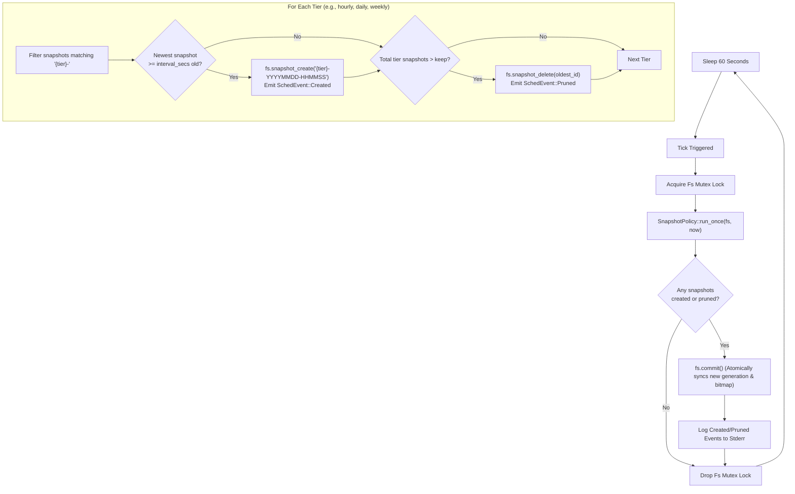

# Telescoping Snapshot Schedules

**Status:** Implemented in `crates/cownfs-nfs/src/snapshot_sched.rs`  
**Applies to:** `cownfs-server`, `cownfs-snapshot`, `.snapshots` NFS virtual directory

---

## 1. Overview

`cownfs` provides automated, NetApp-style telescoping snapshot schedules directly within `cownfs-server`. Because snapshots in `cownfs` are O(1) root pointer copies with copy-on-write (CoW) block sharing, creating scheduled snapshots incurs virtually zero I/O overhead and consumes storage only as data blocks diverge.

A **telescoping schedule** (often referred to as Grandfather-Father-Son retention) provides fine-grained recovery for recent hours while maintaining coarse-grained history for days, weeks, or months without linearly growing storage consumption.

```
Time Horizon:   [ <--- 30 Days ---> ] [ <--- 7 Days ---> ] [ <--- 24 Hours ---> ]
Snapshots kept: Monthly: 12           Weekly: 4            Daily: 7    Hourly: 24
```

---

## 2. Policy Specification & CLI Usage

Snapshot scheduling is enabled on `cownfs-server` using the `--snapshot-policy` flag:

```sh
cownfs-server --snapshot-policy <spec> <image> [addr]
```

### 2.1 Syntax

A policy is a comma-separated list of retention tiers:

```text
spec = tier[:keep][,tier[:keep]]...
```

- **`tier`**: One of the standard predefined intervals:
  - `hourly` — 3,600 seconds (1 hour)
  - `daily` — 86,400 seconds (24 hours)
  - `weekly` — 604,800 seconds (7 days)
  - `monthly` — 2,592,000 seconds (30 days)
- **`keep`** *(optional)*: The maximum number of newest snapshots to retain for that tier. If omitted, standard defaults are applied.

### 2.2 Standard Tiers and Defaults

| Tier Name | Trigger Interval | Default Keep Count | Total Retention Window |
|---|---|---|---|
| `hourly` | 1 hour (3,600s) | 24 | 24 hours |
| `daily` | 24 hours (86,400s) | 7 | 7 days |
| `weekly` | 7 days (604,800s) | 4 | 4 weeks (~1 month) |
| `monthly` | 30 days (2,592,000s) | 12 | 12 months (1 year) |

### 2.3 Example Configurations

* **NetApp Standard (Default recommended):**
  ```sh
  ./target/release/cownfs-server \
      --snapshot-policy hourly:24,daily:7,weekly:4 \
      /data/cow.img 0.0.0.0:2049
  ```
  *Keeps 24 hourly snapshots, 7 daily snapshots, and 4 weekly snapshots.*

* **High-Frequency Development / CI:**
  ```sh
  ./target/release/cownfs-server \
      --snapshot-policy hourly:48,daily:14 \
      /data/cow.img 0.0.0.0:2049
  ```
  *Keeps 48 hours of hourly snapshots and 14 days of dailies.*

* **Daily Archival:**
  ```sh
  ./target/release/cownfs-server \
      --snapshot-policy daily:30,monthly:12 \
      /data/cow.img 0.0.0.0:2049
  ```

---

## 3. Snapshot Naming & User Isolation

### 3.1 Naming Convention

Scheduled snapshots are automatically named according to their tier and UTC creation timestamp:

```text
Name = {tier}-YYYYMMDD-HHMMSS
```

*Example names:*
- `hourly-20261003-140000`
- `daily-20261003-000000`
- `weekly-20261001-000000`

### 3.2 User Snapshot Protection

The scheduler operates under strict namespace isolation:
- **Managed snapshots:** The scheduler will only evaluate or prune snapshots that begin with `{tier}-` (e.g. `hourly-`, `daily-`).
- **User snapshots:** Any snapshots created manually via the CLI (`cownfs-snapshot create /data/cow.img pre-upgrade-backup`) or management APIs **are never deleted or modified** by the automated scheduler, even if retention limits for scheduled tiers are exceeded.

---

## 4. Execution Engine & Lifecycle

The snapshot scheduler runs as an autonomous background thread within the server daemon.



### 4.1 Evaluation Algorithm
1. **Periodic Tick:** Every 60 seconds, the scheduler thread wakes up and acquires the filesystem lock (`sched_shared.fs.lock()`).
2. **Due Check:** For each configured tier, the scheduler locates the newest snapshot carrying the tier's prefix. If no snapshot exists or the elapsed time since the newest timestamp is at least `interval_secs`, a snapshot is created.
3. **Collision Handling:** If a snapshot with the exact target timestamp name already exists, the creation is skipped (`SchedEvent::SkippedCollision`).
4. **Pruning:** Snapshots for each tier are sorted by timestamp and ID. Any snapshot exceeding the configured `keep` count is pruned using `fs.snapshot_delete()`. Unparseable tier-prefixed names sort as oldest and rotate out first.
5. **Atomic Commit:** If any snapshot was created or deleted, `fs.commit()` is executed immediately, persisting the new generation, updating root metadata, and queuing orphan blocks for space reclamation (see [garbage-collection.md](garbage-collection.md)).

---

## 5. Browsing Snapshots over NFS (`.snapshots`)

Clients do not need special utilities to restore or inspect snapshot versions. Every directory exported over NFS exposes a virtual `.snapshots` directory.

### 5.1 Navigating Previous Versions

From any mounted NFS client (macOS or Linux):

```sh
cd /Volumes/cow

# List all available scheduled and user snapshots
ls -la .snapshots
```

*Output:*
```
dr-xr-xr-x  1 root  wheel  0 Oct  2 23:00 .
drwxr-xr-x  1 root  wheel  0 Oct  2 22:50 ..
dr-xr-xr-x  1 root  wheel  0 Oct  2 21:00 hourly-20261002-210000
dr-xr-xr-x  1 root  wheel  0 Oct  2 22:00 hourly-20261002-220000
dr-xr-xr-x  1 root  wheel  0 Oct  2 23:00 hourly-20261002-230000
dr-xr-xr-x  1 root  wheel  0 Oct  2 00:00 daily-20261002-000000
dr-xr-xr-x  1 root  wheel  0 Oct  2 22:30 manual-backup
```

### 5.2 File Recovery

To restore an accidentally overwritten or deleted file:

```sh
# View old content
cat .snapshots/hourly-20261002-220000/important.docx > /tmp/recovered.docx

# Or copy it back in place
cp .snapshots/hourly-20261002-220000/important.docx ./important.docx
```

### 5.3 Immutability

Snapshots viewed over NFS are strictly read-only:
```sh
rm .snapshots/hourly-20261002-220000/important.docx
# Output: rm: .snapshots/hourly-20261002-220000/important.docx: Read-only file system (NFS4ERR_ROFS)
```

---

## 6. Manual Snapshot Management (`cownfs-snapshot`)

For out-of-band administration or scripts, the `cownfs-snapshot` binary provides direct offline snapshot control:

### 6.1 Create
```sh
./target/release/cownfs-snapshot create /data/cow.img pre-upgrade-snap
```

### 6.2 List
```sh
./target/release/cownfs-snapshot list /data/cow.img
```
*Output:*
```
ID      Name
1       hourly-20261002-220000
2       hourly-20261002-230000
3       pre-upgrade-snap
```

### 6.3 Details
```sh
./target/release/cownfs-snapshot info /data/cow.img 3
```

### 6.4 Delete
```sh
./target/release/cownfs-snapshot delete /data/cow.img 3
```
*Note: Deleting a snapshot immediately releases its pinned blocks for garbage collection on the next transaction commit.*

---

## 7. Operational Best Practices

1. **Space Monitoring:** While snapshot creation is instantaneous and zero-cost initially, data blocks overwritten in the live filesystem are kept pinned by snapshots. Monitor free space using Prometheus metrics (`curl http://localhost:3049/metrics | grep cownfs_space`).
2. **Replication Integration:** Snapshot schedules work hand-in-hand with `cownfs-replicate`. `cownfs-replicate` uses snapshot diffs to send incremental block runs to off-site replicas.
3. **Read-Only Server Replicas:** If running `cownfs-server --read-only`, the snapshot scheduler is automatically disabled (with a log warning). Only write primaries create scheduled snapshots.
